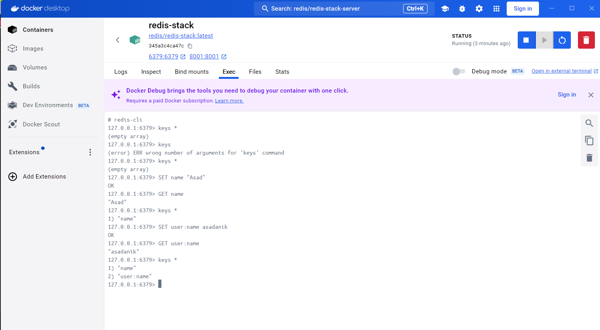
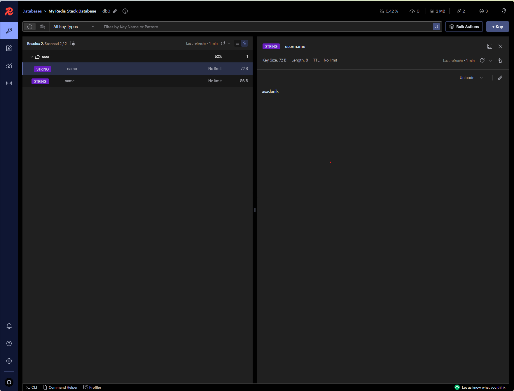

# Redis Caching and Artillery Load Testing

HTTP request caching is the process of storing the results of HTTP requests (responses) temporarily to improve performance and reduce the need for redundant processing or querying of the backend/database. **Redis**, an in-memory data store, is commonly used for this purpose due to its speed and versatility.

**Redis** (Remote Dictionary Server) is an open-source, in-memory key-value store used as a database, cache, and message broker. It is designed for high performance, scalability, and versatility, making it a popular choice in modern application architectures.

Redis is an in-memory database. Which implies that the data must be ephemeral. But Redis does have 2 persistence (**RDB** or **AOF**) mechanisms built in, allowing it to store data on disk to recover from crashes or restarts.

### **Why Use Redis for Caching HTTP Requests?**

1. **Performance:** Redis operates entirely in memory, making it extremely fast.
2. **Scalability:** It supports high-throughput operations, suitable for large-scale applications.
3. **TTL (Time-to-Live):** Redis supports expiration policies, ensuring cached data doesn't become stale.
4. **Flexible Data Structures:** Redis supports strings, hashes, lists, and more, making it ideal for storing varied response formats.
5. **Reduced Load on Backend:** Caching reduces the number of expensive database queries or API calls.

### **How Does It Work?**

1. **Intercept the Request:**
    - Before processing an HTTP request, check if a cached response for the request exists in Redis.
2. **Retrieve from Cache:**
    - If cached data exists, return it directly, skipping the backend processing.
3. **Process and Cache Miss:**
    - If no cached data exists (cache miss), process the request, store the result in Redis, and send it to the client.
4. **Set Expiration:**
    - Use Redis' TTL feature to ensure that the cache is refreshed periodically.

### **Advantages of Using Redis for HTTP Request Caching**

1. **Faster Response Times:**
    - Subsequent requests are served from the cache, reducing latency.
2. **Reduced Backend Load:**
    - Minimizes database queries or external API calls.
3. **Scalability:**
    - Redis can handle high-throughput workloads, making it ideal for large-scale systems.
4. **Cost Savings:**
    - By reducing redundant API calls, you save bandwidth and processing costs.

### **Real-World Use Cases**

- **API Responses:** Cache frequently accessed API responses like weather data or stock prices.
- **Database Queries:** Cache results of expensive database queries to reduce load.
- **User Sessions:** Store user session data in Redis for fast retrieval.

## Redis vs Redis-Stack

While **standard Redis** is powerful in its own right, **Redis Stack** adds a suite of specialized modules that enable Redis to perform advanced operations across multiple data types (search, time-series data, AI models, etc.). These modules make Redis Stack more suited for complex use cases.

### Advantages of Redis-Stack:

1. **Advanced Features**: Redis Stack makes it easier to perform advanced tasks like full-text search, graph operations, and time-series analytics, without needing to integrate multiple third-party tools.
2. **Ease of Use**: Redis Stack provides a unified interface for various data operations. Instead of using different databases or services for different data types, Redis Stack provides integrated solutions.
3. **Scalability**: Just like standard Redis, Redis Stack is designed to scale horizontally, handling large datasets and high throughput.
4. **Industry Adoption**: Redis Stack is gaining traction in the industry, especially for use cases that require more than just basic caching, like:
    - Real-time data processing (**RedisTimeSeries**)
    - Advanced analytics and search (**RedisSearch**)
    - Handling graph-related workloads (**RedisGraph**)
    
    These use cases are becoming increasingly common in production systems.
    

### Is Redis-Stack Good for Industry-Standard and Production Software Development?

- **Yes**, Redis Stack can be very useful in **production environments** for certain use cases where you need advanced data capabilities beyond simple key-value storage.
- **If your application requires** real-time analytics, advanced querying, graph processing, or managing large-scale JSON data, Redis Stack would provide a significant benefit over using standard Redis.

However, if your application **only requires basic caching or session management**, Redis (without Stack) might be sufficient. For these simpler use cases, using Redis Stack may be overkill.

### Industry Perspective:

- **Redis Stack** is relatively new but is gaining adoption, especially in **modern, real-time applications** where caching, search, and analytics are all needed in one system. It allows teams to **reduce the number of tools they need** by consolidating several capabilities in a single Redis instance.
- **Redis alone** remains the industry standard for **caching, queuing, and simple data storage**. It's well-established in production and used by many high-traffic platforms (e.g., Twitter, GitHub, Instagram).

## Starting Redis server with Docker

Yes, you can run Redis using Docker! Docker makes it simple to run Redis instances without having to install Redis directly on your system. Here's how to do it step by step:

### Run Redis-Stack with `docker run`

**→ `docker pull redis`**

Once there image is pulled, you can run the redis-stack container with following redis run command,

→ **`docker run --name redis-container -d -p 6379:6379 redis`**

Check the running container with: → **`docker ps`**

**Explanation:**

- `-name redis-container`: Names the container `redis-container`.
- `d`: Runs the container in detached mode (background).
- `p 6379:6379`: Maps the container's Redis port (6379) to the host's port (6379).

---

You should see something like this:

```
CONTAINER ID   IMAGE    COMMAND                  STATUS         PORTS                    NAMES
abcdef123456   redis    "docker-entrypoint.s…"   Up 2 minutes   0.0.0.0:6379->6379/tcp   redis-container
```

---

**Connect to Redis CLI:**

You can access the Redis CLI inside the running container using:

Now you can interact with Redis:

→ **`docker exec -it redis-container redis-cli`**

```bash
127.0.0.1:6379> SET name "Alice"
OK
127.0.0.1:6379> GET name
"Alice"
```

**Run Redis with Persistent Storage:**

By default, Redis data is stored in memory and lost when the container stops. To persist data, map a volume:

**→ `docker run --name redis-container -d -p 6379:6379 -v redis-data:/data redis`**

**Explanation:**

- `v redis-data:/data`: Maps a named volume `redis-data` to `/data` inside the container, where Redis stores its data.

---

**Customizing Configuration:**

You can use your custom Redis configuration file by mounting it:

1. Create a `redis.conf` file with your custom configuration.
2. Run Redis with the custom config:
    
    → **`docker run --name redis-container -d -p 6379:6379 -v $(pwd)/redis.conf:/usr/local/etc/redis/redis.conf redis redis-server /usr/local/etc/redis/redis.conf`**
    

---

**Stopping and Removing the Redis Container:**

To stop the container:

→ **`docker stop redis-container`**

To remove the container:
→ **`docker rm redis-container`**

---

Redis with Docker is a powerful way to quickly spin up a Redis instance for development or production. The flexibility of Docker ensures you can configure and manage Redis efficiently.

### Using Redis with `docker-compose` file into project

```tsx
version: '3.9' # Docker Compose file version

services:
  redis:
    image: redis:latest # Use the latest Redis image
    container_name: redis-container # Name the container
    ports:
      - "6379:6379" # Map host port 6379 to container port 6379
    volumes:
      - redis-data:/data # Persist data using a named volume
    command: ["redis-server", "--save", "60", "1", "--loglevel", "warning"] # Optional: Configure Redis server

volumes:
  redis-data:
```

### How to Use the `docker-compose.yml` File

1. Save the file as `docker-compose.yml`.
2. Start the Redis service:
    
    → **`docker-compose up -d`**
    
3. Verify the Redis container is running:
    
    → **`docker ps`**
    
4. Stop the Redis service:
    
    → **`docker-compose down`**
    

### Using Node.js Redis Client:

You can use the `@redis/client` library in a Node.js application to interact with Redis:

1. Install the Redis client:
    
    → **`npm install @redis/client`** 
    
2. Example usage in a Node.js script:

```tsx
const { createClient } = require('@redis/client');

// Create a Redis client instance
const client = createClient({
  url: 'redis://127.0.0.1:6379',  // Connect to Redis server running on localhost:6379
  // Optional: If Redis is password-protected, you can include the password like:
  // password: 'yourpassword',
});

client.on('error', (err) => console.log('Redis Client Error', err));

async function connectToRedis() {
  // Connect to Redis
  await client.connect();
  console.log('Connected to Redis');

  // Example: Set and get a key-value pair
  await client.set('key', 'value');
  const value = await client.get('key');
  console.log('Retrieved value:', value);

  // Don't forget to close the connection when done
  await client.quit();
}

// Execute the function to connect and interact with Redis
connectToRedis();
```

### Step 5: Stop Redis Stack

To stop the Redis Stack container, use the following command:

→ **`docker-compose down`**

This will stop and remove the container but keep the data in the `redis-data` volume.

---

This setup gives you a clean and easy way to manage Redis using Docker Compose. You can further customize it based on your requirements!

## Start Redis-Stack with Docker

[Run Redis Stack on Docker](https://redis.io/docs/latest/operate/oss_and_stack/install/install-stack/docker/)

To run **Redis Stack** with Docker, you can use the official Redis Stack Docker image provided by Redis Labs. Redis Stack includes Redis along with powerful modules like RedisJSON, RedisSearch, RedisGraph, and more.

To get started with Redis Stack using Docker, you first need to select a Docker image:

- **`redis/redis-stack`** contains both Redis Stack server and Redis Insight. This container is best for local development because you can use the embedded Redis Insight to visualize your data.
- **`redis/redis-stack-server`** provides Redis Stack server only. This container is best for production deployment.

Here’s a step-by-step guide to get Redis Stack up and running using Docker:

### Run Redis-Stack with `docker run`

Pulling Redis-Stack

→ **`docker pull redis/redis-stack:latest`**

Pulling Redis-Stack-Server

**→ `docker pull redis/redis-stack-server:latest`**

Once there image is pulled, you can run the redis-stack container with following redis run command. To start Redis Stack server using the **`redis-stack-server`** image, run the following command in your terminal:

**→ `docker run -d --name redis-stack-server -p 6379:6379 redis/redis-stack-server:latest`**

### redis/redis-stack

To start a Redis Stack container using the **`redis-stack`** image, run the following command in your terminal:

**→ `docker run -d --name redis-stack -p 6379:6379 -p 8001:8001 redis/redis-stack:latest`**

Or, with Redis Password if you want so,

→ **`docker run -d --name redis-stack -p 6379:6379 -p 8001:8001 -e REDIS_ARGS="--requirepass 12345678" redis/redis-stack:latest`**

The **`docker run`** command above also exposes Redis Insight on port 8001. You can use Redis Insight by pointing your browser to **`localhost:8001`**.

**⇒ Check with Docker Execute inside Redis-stack to create sample  `key-value`** 



**⇒ Redis Insight by [`http://localhost:8001/redis-stack/browser`](http://localhost:8001/redis-stack/browser)**



## **Connect with redis-cli**

You can then connect to the server using **`redis-cli`**, just as you connect to any Redis instance.

If you don’t have **`redis-cli`** installed locally, you can run it from the Docker container:

**→ `docker exec -it redis-stack redis-cli`**

**Or, we can use the docker-compose file to write the configuration to use simply.**

### Step 1: Create a `docker-compose.yml` File

First, create a `docker-compose.yml` file to define the Redis Stack container.

```yaml
version: '3.8'

services:
  redis:
    image: redis/redis-stack-server:latest
    container_name: redis-stack
    ports:
      - "6379:6379"  # Expose the default Redis port
    environment:
      - REDIS_PASSWORD=yourpassword  # Optional: Set a password for Redis
    volumes:
      - redis-data:/data  # Store Redis data persistently

volumes:
  redis-data:
    driver: local
```

- `image: redis/redis-stack-server:latest`: This pulls the latest Redis Stack server image from Docker Hub.
- `ports`: This exposes the Redis Stack on port `6379` on your local machine.
- `volumes`: This ensures Redis data persists even if the container stops.
- `REDIS_PASSWORD`: (Optional) You can set a password to secure your Redis instance.

### Step 2: Run the Redis Stack Container

1. **Navigate to the directory** where your `docker-compose.yml` file is located.
2. **Run the following command** to start Redis Stack:
    
    → **`docker-compose up -d`**
    

This will download the Redis Stack image and run it in the background.

### Step 3: Verify Redis Stack is Running

Once the container starts, you can verify that Redis Stack is running correctly by checking the status:

→ **`docker ps`**

You should see something like this:

```
CONTAINER ID   IMAGE                             COMMAND                  CREATED         STATUS         PORTS                    NAMES
a1b2c3d4e5f6   redis/redis-stack-server:latest   "docker-entrypoint.s…"   2 minutes ago   Up 2 minutes   0.0.0.0:6379->6379/tcp   redis-stack
```

### Step 4: Connect to Redis Stack

You can now connect to Redis Stack using any Redis client (e.g., `redis-cli`, a Node.js client, or other Redis clients).

### Using `redis-cli`:

If you have `redis-cli` installed locally, you can connect to Redis Stack by running:

→ **`redis-cli -h 127.0.0.1 -p 6379`**

If you’ve set a password for Redis, use:

→ **`redis-cli -h 127.0.0.1 -p 6379 -a yourpassword`**

### Using Node.js Redis Client:

You can use the `@redis/client` library in a Node.js application to interact with Redis Stack:

1. Install the Redis client:
    
    → **`npm install @redis/client`** 
    
2. Example usage in a Node.js script:

```tsx
const { createClient } = require('@redis/client');

const client = createClient({
  url: 'redis://127.0.0.1:6379',
});

client.on('error', (err) => console.log('Redis Client Error', err));

async function connectToRedis() {
  await client.connect();
  console.log('Connected to Redis Stack');

  // Example: Set and get a key-value pair
  await client.set('key', 'value');
  const value = await client.get('key');
  console.log('Retrieved value:', value);

  await client.quit();
}

connectToRedis();
```

### Step 5: Stop Redis Stack

To stop the Redis Stack container, use the following command:

→ **`docker-compose down`**

This will stop and remove the container but keep the data in the `redis-data` volume.

## **Cache-Aside Pattern in Redis**

The **Cache-Aside Pattern** (also known as **Lazy Loading**) is a caching strategy commonly used in applications to optimize data access and improve performance. It works by storing frequently accessed data in a cache (e.g., Redis), and if the requested data isn't found in the cache (a cache miss), it's fetched from the database and then added to the cache for future use.

---

### **How Cache-Aside Works**

1. **Application Requests Data**:
    - The application first checks the cache (Redis) for the data.
    - If the data is found in the cache, it's returned directly (**cache hit**).
2. **Cache Miss**:
    - If the data isn't found in the cache, the application retrieves it from the database.
3. **Populate the Cache**:
    - The application stores the data in the cache for future requests.
4. **Data Update**:
    - When data is updated in the database, the cache is either invalidated or updated to ensure consistency.

---

### **Advantages of Cache-Aside Pattern**

- **Reduced Latency**: Frequently requested data is served from the cache, which is much faster than querying a database.
- **Scalability**: Reduces the load on the database by serving repetitive requests from the cache.
- **Flexible Cache Population**: Only data that is accessed is cached, optimizing memory usage.

---

### **Challenges**

1. **Cache Invalidation**: Ensuring the cache stays in sync with the database can be tricky.
2. **Stale Data**: Cached data might be outdated if not properly managed.
3. **Cold Start**: The cache is empty initially, leading to potential performance hits until the cache is populated.

## Pub/Sub Pattern in Redis

The **Publish/Subscribe (Pub/Sub)** pattern in Redis is a messaging system that allows multiple processes or systems to communicate with each other in real-time. It is based on a publisher and subscriber model, where:

- **Publisher**: Sends messages to a "channel."
- **Subscriber**: Listens to a specific "channel" to receive messages.

Redis acts as the broker, managing the communication between publishers and subscribers.

---

### **How Does Pub/Sub Work?**

1. **Subscribers Subscribe to a Channel**:
    - A client subscribes to one or more channels.
    - The subscriber remains idle until a message is published to a subscribed channel.
2. **Publisher Sends a Message**:
    - A publisher sends a message to a specific channel.
    - Redis delivers the message to all clients subscribed to that channel.
3. **Real-Time Delivery**:
    - Messages are immediately delivered to all subscribers of the channel.

---

### **Why Use Pub/Sub in Redis?**

- **Real-Time Communication**:
    - Ideal for applications requiring instant updates like chat apps, live notifications, or collaborative tools.
- **Decoupling Components**:
    - Publishers and subscribers do not need to know about each other, enabling a loosely coupled architecture.
- **Scalability**:
    - Redis efficiently manages messaging for multiple subscribers and publishers, making it suitable for scalable systems.

---

### **Common Use Cases**

1. **Chat Applications**:
    - Users in a chat room subscribe to a channel to receive messages sent to that room.
2. **Live Notifications**:
    - Real-time alerts or updates for events like stock price changes, game scores, etc.
3. **Distributed Systems**:
    - Synchronizing data or states across microservices or nodes in a cluster.
4. **Event Broadcasting**:
    - Broadcasting events like system health updates or user activity logs.

---

### **Advantages**

1. **Real-Time Messaging**:
    - Immediate delivery of messages ensures real-time responsiveness.
2. **Simplifies Communication**:
    - Decouples publishers and subscribers, simplifying the architecture.
3. **Lightweight**:
    - Redis Pub/Sub is efficient and easy to set up.

---

### **Limitations**

1. **Ephemeral Messages**:
    - Messages are lost if no clients are subscribed at the time of publishing.
    - Redis does not persist messages in Pub/Sub.
2. **Not Suitable for High Durability**:
    - For durable messaging, use systems like RabbitMQ or Kafka.
3. **Scaling Across Clusters**:
    - Pub/Sub is limited to a single Redis instance or cluster partition.

## Load/Stress Testing with Artillery

[Welcome – Artillery Docs](https://www.artillery.io/docs)

Artillery is a modern, powerful, and easy-to-use tool for **load testing** and **functional testing** of backend APIs, services, and systems. It is designed to help developers and teams simulate real-world scenarios and measure the performance, scalability, and reliability of their APIs.

### **Purpose of Using Artillery in a Backend API Project**

1. **Load Testing**:
    - Simulates multiple users interacting with your API simultaneously.
    - Helps identify how the API performs under heavy traffic and whether it can handle peak loads.
2. **Stress Testing**:
    - Pushes the API beyond its expected limits to identify breaking points and bottlenecks.
    - Useful for determining how the system behaves under extreme conditions.
3. **Performance Benchmarking**:
    - Measures response times, throughput, and latency.
    - Compares performance metrics across different versions of your API or infrastructure configurations.
4. **Functional Testing**:
    - Validates the correctness of API responses under load.
    - Ensures the API returns expected results even when serving multiple concurrent requests.
5. **Scalability Testing**:
    - Evaluates the API's ability to scale as user load increases.
    - Helps plan resource allocation (e.g., server capacity, database scaling).
6. **Regression Testing**:
    - Detects performance regressions when new features or updates are deployed.
    - Ensures the system's performance remains consistent over time.
7. **Reliability Testing**:
    - Verifies the API's stability over extended periods of sustained load.
    - Ensures the system doesn't degrade under prolonged usage.

### **Why Use Artillery Over Other Tools?**

1. **Ease of Use**:
    - Simple YAML configuration for defining test scenarios.
    - Minimal setup required to get started.
2. **Flexibility**:
    - Supports HTTP, WebSocket, Socket.io, and gRPC protocols.
    - Custom JavaScript logic for advanced scenarios.
3. **Realistic Traffic Simulation**:
    - Allows for defining complex scenarios with realistic traffic patterns, think times, and user behaviors.
4. **Scalability**:
    - Can be used for small-scale local testing or large-scale distributed testing with Artillery Pro.
5. **Extensibility**:
    - Can be integrated into CI/CD pipelines to automate performance testing.
    - Supports plugins for additional functionality.

---

### **Example: Using Artillery for API Load Testing**

1. **Install Artillery**:
    
    → **`npm install -g artillery`**
    
    Or, Install inside project..
    
    → **`npm install --save-dev artillery`**
    
2. **Create a Test Configuration File (e.g., `load-test.yml`)**:
    
    ```yaml
    config:
    	target: 'http://localhost:8080'
    	phases:
    		- name: 'warmup'
    			duration: 60
    			arrivalRate: 10
    
    scenarios:
    	- name: "Search for photos"
    		flow:
    			- get:
    					url: "/photos?_start=0&_limit=10"
    ```
    
    <aside>
    💡
    
    ### **`config` :**
    
    This section sets up the target server and the behavior of the test.
    
    - **`target`:**
        - Specifies the base URL of the server being tested.
        - Here, it points to `http://localhost:8080`, which is likely the development or staging server of the application.
    - **`phases`:**
        - Defines the load profile for the test, describing how the load will change over time.
        - **`name: 'warmup'`:**
            - This phase is named "warmup" and is intended to prepare the system for the test. It can be used to simulate users gradually starting to interact with the system.
        - **`duration: 60`:**
            - This phase lasts for 60 seconds.
        - **`arrivalRate: 10`:**
            - Specifies the rate at which virtual users (VUs) arrive during the test phase. In this case, **10 requests per second** are sent to the server.
    
    ### **`scenarios` :**
    
    This section defines what each virtual user (VU) will do when it interacts with the target server.
    
    - **`name: "Search for photos"`**
        - A descriptive name for the scenario, indicating that it tests the "Search for photos" functionality.
    - **`flow`:**
        - The sequence of actions that the virtual user will execute during this scenario. It represents a user journey or workflow.
        - **`get:`**
            - Specifies that this step is an HTTP `GET` request.
            - **`url: "/photos?_start=0&_limit=10"`**
                - The endpoint `/photos` is queried with the parameters `_start=0` and `_limit=10`.
                - This likely retrieves the first 10 photos (pagination) from the `/photos` endpoint.
    </aside>
    
3. **Run the Test**:
    
    → **`artillery run load-test.yml`**
    
    Or, If installed inside project then..
    
    → **`npx artillery run load-test.yml`**
    
4. **Output**:
    - Artillery provides detailed metrics such as requests per second, response times, and error rates.

---

### **Key Metrics Artillery Helps Evaluate**

- **Latency**:
    - Measures the time it takes for the API to respond to a request.
- **Throughput**:
    - Tracks the number of requests handled by the API per second.
- **Error Rate**:
    - Identifies the percentage of failed requests during the test.
- **System Resource Usage**:
    - Observes the CPU, memory, and network utilization on the server during the test.

---

### **When to Use Artillery in a Backend Project?**

- **Pre-Deployment Testing**:
    - Ensure the API is production-ready by validating its performance under expected traffic.
- **Post-Deployment Monitoring**:
    - Regularly test APIs in staging or production environments to catch regressions.
- **API Optimization**:
    - Identify bottlenecks in endpoints and optimize them for better performance.
- **Scaling Events**:
    - Simulate traffic surges during events like promotions, product launches, or campaigns.

### **Conclusion**

Artillery is an essential tool for backend API projects to ensure the system is performant, scalable, and reliable under various conditions. It helps developers proactively identify issues before users encounter them, ultimately leading to better software quality and user satisfaction.

## Using into Node (Express) Application

We are going to using Redis with our Application with the help of the package called `ioredis` NPM. Basically this is robust Redis client for Node application.

[npm: ioredis](https://www.npmjs.com/package/ioredis)

### Let’s check the load of the application by using the Artillery

We have to make a file for load testing called `load-test.yml` this file. Here we have to write configuration for artillery run to test the load of your application.

- → **`my-app/load-test.yml`**
    
    ```yaml
    config:
    	target: 'http://localhost:8080'
    	phases:
    		- name: 'warmup'
    			duration: 60
    			arrivalRate: 10
    
    scenarios:
    	- name: "Search for photos"
    		flow:
    			- get:
    					url: "/photos?_start=0&_limit=10"
    ```
    

⇒ Then you can run this with your global Artillery from the system, or you can run that Artillery within the project here.

**Run from inside project → `npx artillery run load-test.yml`**

Create script command for the artillery to run the load testing. Add script to **`package.json`** for the script of artillery run.

- **→ `my-app/package.json`**
    
    ```json
     "scripts": {
        "load-test": "artillery run load-test.yml"
      }
    ```
    

**Run the script →** **`npm run load-test`**

### Configure the Redis into the Project

Now we are going to configure the redis into the project as for Caching.